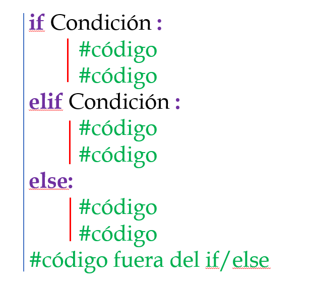
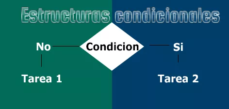
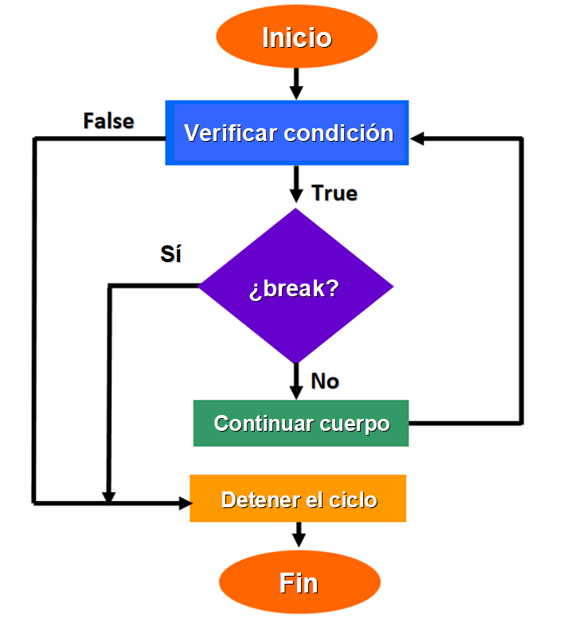
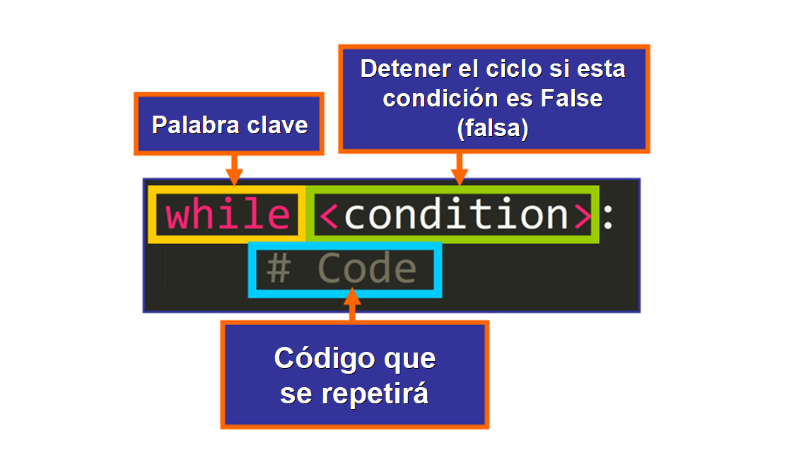
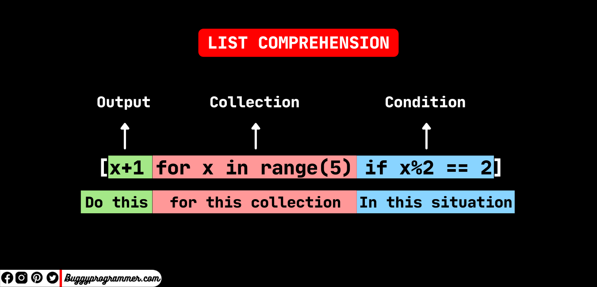
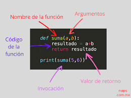
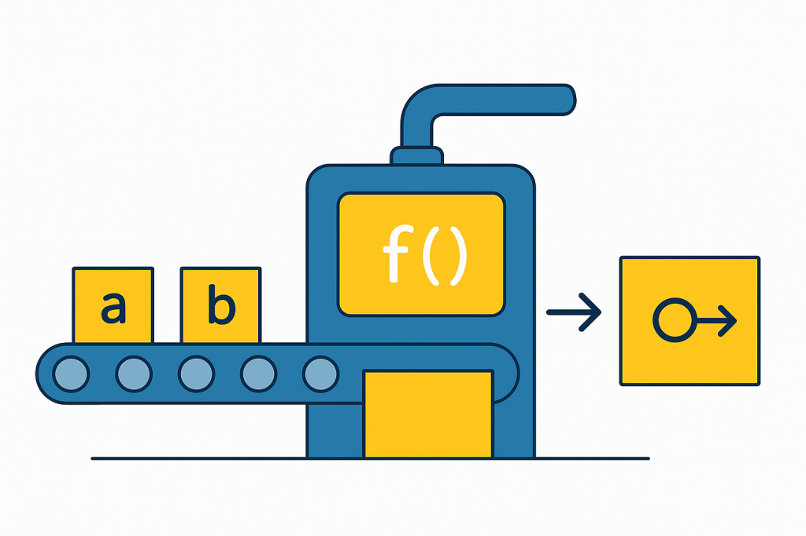
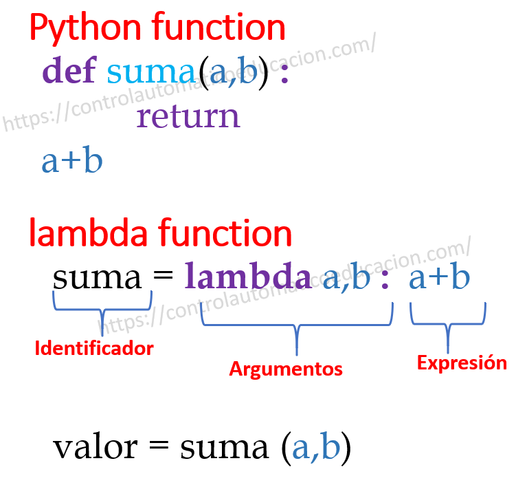
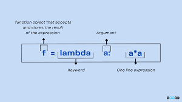

# Preguntas Teóricas

## Pregunta 1: ¿Qué es un condicional?

### Definición
Un condicional es aquel bloque de código o sentencia que funciona solo si se cumple una condición específica previamente estipulada mediante `if`. De no ser así, no realizará la orden que tenga redactada; sin embargo, se puede añadir una acción alternativa con `else`. 

También existe la opción de añadir una segunda condición utilizando `elif`, el cual es la combinación de `else`e `if`.

Como añadido, si la condición incluye comparativas entre números o cadenas se pueden usar los siguientes signos:
- Igual a:  ==
- No igual a:  !=
- Mayor a: >
- Menor a: <
- Mayor o igual a: >=
- Menor o igual a : <=
### Usos
Las condicionales en el código tienen diversos usos, ya que son muy útiles para ejecutar la acción que queremos, pero solo bajo las circunstancias que le especifiquemos al ordenador.

Uno de los usos más comunes es que el código suceda mientras algún elemento sea True, es decir, que exista o que aparezca; o por el contrario, que se ejecute solo cuando el elemento sea False, es decir, cuando no esté o desaparezca.

Otro de los usos comunes es que la acción se realice cuando una cadena o número sea igual al que hemos colocado como fijo en la condicional. Como añadido, si son números podemos introducir también el concepto de que la condicional se realice si el número es mayor, menor, múltiplo, divisor... del número que hemos indicado, o solo si es par o impar.
### Sintaxis
La sintaxis de una condicional es:

```python
if condición:
    print('Se cumple la condición')
elif condición:
    print('Se cumple la condición')
else:
    print('No se cumple la condición')
```
### Ejemplos
Ejemplo 1:
```python
lista_de_invitados = ['María', 'Juan', 'Adolfo', 'Raúl']

if 'Juan' in lista_de_invitados:
    print('Está el cumpleañero')
else:
    print('No está el cumpleañero')
```
Ejemplo 2:
```python
if suscripción is True:
    print('¡Felicidades!, te has suscrito de forma exitosa')
```
Ejemplo 3:
```python
if edad >= 21 and edad < 85:
    print('Puedes alquilar un coche')
elif edad >= 85:
    print('Eres demasiado mayor para alquilar un coche')
else:
    print('Eres demasiado joven para alquilar un coche')
```
### Imágenes


## Pregunta 2: ¿Cuáles son los diferentes tipos de bucles en Python? ¿Por qué son útiles?

### Definición
En Python existen **dos** tipos de bucles: el `for` y el `while`.

El bucle `for` funciona de forma finita, es decir, recorre cada elemento de una secuencia estipulada (lista/tupla/diccionario/set) realizando la acción, o de un rango de números. Pero una vez haya acabado de ir uno por uno y llegue al último, realizará la acción por ese último elemento y acabará. En conclusión, se ejecuta un número **determinado** de veces.

El bucle `while`, al contrario que el anterior, va a seguir realizando la acción hasta que lo detengamos o hasta que el estado cambie (`True`o `False`). Este bucle puede llevar a un bug (el bucle infinito) en el que este sigue incluso cuando no queremos que se realice la acción por no haber cambiado el estado de `True` a `False`, lo que puede saturar el ordenador. En conclusión, se ejecuta un número **indeterminado o infinito** de veces.
### Usos
Cada tipo de bucle nos puede servir para distintos usos.

El bucle `for` nos sirve para cuando queremos que una acción suceda por cada uno de los elementos de un conjunto iterable, como puede ser por cada elemento de una lista. Son situaciones en las que queremos sendas acciones para sendos elementos, ni una más ni una menos.

El bucle `while` nos sirve para cuando queremos que se realice una acción mientras que una situación sea `True` o `False`. Son situaciones en las que no tenemos elementos iterables y queremos que se realice una acción hasta que dicha situación cambie.
### Sintaxis
Sintaxis del bucle `for`:
```python
for elemento in secuencia:
    print('Uno más')
```
Sintaxis del bucle `while`:
```python
while condición:
    print('Es True')
```
### Ejemplos
Ejemplo 1:
```python
lista_de_invitados = ['María', 'Juan', 'Adolfo', 'Raúl']

for invitado in lista_de_invitados:
    print(f'¡Has venido, {invitado}!')
```
Ejemplo 2.
```python
for número in range(1, 10):
    print(f'Tienes {número} de clientes')
```
Ejemplo 3:
```python
while edad <18:
    print('No puedes comprar alcohol')
```
Ejemplo 4:
```python
while suscrito == True:
    print('¡Mira nuestra revista semanal!')
```
Nota del ejemplo 4: Esto sería un bucle infinito, la única forma de pararlo sería cerrando el programa. Para que funcionase de la manera correcta haría más falta más código para que solo lo imprima una vez por semana (en base al contexto), pero para mantenerlo simple y que se entienda para qué se puede usar el bucle while lo mantendré así simple.
### Imágenes


## Pregunta 3: ¿Qué es una lista por comprensión en Python?

### Definición
En python, el término de lista por comprensión hace referencia a una forma corta de crear listas aplicando un **filtro** o **transformación** a los elementos de otra lista/secuencia. Un detalle **muy** importante es que se debe expresar en **una única línea**.

Para realizar esto es necesario utilizar el bucle `for`, del cual hemos hablado antes, así como puede que también fórmulas matemáticas (aunque sean simples como puede ser una suma sencilla).
### Usos
Los usos de las listas por comprensión están principalmente enfocados en la automatización. Mediante estas listas es posible clasificar cadenas o números en nuevas listas sin tener que hacerlo manualmente. Esto es extremadamente útil cuando las cadenas o números que hay que meter en la lista son muchos.

Otro uso que se le puede dar es transformar una lista de números, o clasificarlos en basea si son pares o no.
### Sintaxis
Para expresar una lista por comprensión se hace de la siguiente manera:
```python
números = range(0, 20)

lista_por_comprensión = [num for num in números]
```
### Ejemplos
Ejemplo 1:
```python
números = range(1, 11)

tabla_del_doce = [num * 12 for num in números]
```
Ejemplo 2:
```python
frase = 'Esto es una frase'

vocales = [vocal for vocal in frase if vocal in 'aeiou']
```
Ejemplo 3:
```python
nombres = ['María', 'Juan', 'Miguel', 'Aiur', 'Dolores', 'Lore', 'Angustias', 'Inés']

nombres_cortos = [corto for corto in nombres if len(corto) <= 4]
```
### Imágenes

## Pregunta 4: ¿Qué es un argumento en Python?

### Definición
En python se le llama argumento a todo aquello que hay que introducir entre los paréntesis de una función para que esta ejecute la acción deseada. Existen los argumentos por defecto, los cuales son aquellos que se colocan como valor por defecto a la hora de escribir las funciones. 

Muchas veces las funciones requieren de un valor externo a esta para que funcionen, pero en ocasiones se necesita que esas mismas funciones sigan adelante incluso sin especificar ese valor, por lo que se pone uno por defecto para que no suceda ningún error/bug. 
### Usos
El principal uso es que el código funcione de forma correcta incluso sin los valores que necesitan las funciones que están expresadas.

Dependiendo de la acción que realice la función, necesitará ninguno, uno o más argumentos para que se ejecute. Sin ellos, la mayoría de las veces, las funciones no se podrían ejecutar. Además, estos sirven para correlacionar funciones con partes del código, y es recomendable que tengan nombres deductivos para que no ocurran errores a la hora de asignar los valores.
### Sintaxis
La sintaxis para los argumentos en python es la siguiente:
```python
def función (argumento_uno = valor, argumento_dos):
    acción
```
### Ejemplos
Ejemplo 1:
```python
def correo_de_bienvenida(nombre = 'Eusebio'):
    print(f'Bienvenido, {nombre}!\nNos alegra que te hayas unido!')
```
Ejemplo 2:
```python
def calculadora_sumatoria(num_uno = 1, num_dos = 1):
    print(num_uno + num_dos)
```
Ejemplo 3:
```python
def clima(temperatura, lluvia, viento):
    if temperatura < 15 and lluvia == True and viento == True:
        print('Mal tiempo')
    else:
        print('Buen tiempo')
```
### Imágenes


## Pregunta 5: ¿Qué es una función Lambda en Python?

### Definición
Una función Lambda en python es aquella función que no necesita tener nombre y solo se va a usar para un fragmento de código, generalmente corto. Sin embargo, eso no significa que solo se pueda utilizar una vez; al contrario, se puede usar múltiples veces, ya que se considera una "función sin nombre", la cual se puede almacenar en una variable.
### Usos
Las lambdas tienen el principal uso de actuar como una función pero sin la necesidad de crear una para cada vez que queremos realizar una acción. Además permite almacenar dicha acción en una variable.
### Sintaxis
La sintaxis para una lambda es la siguiente:
```python
variable = lambda valor_uno, valor_dos: acción
```
### Ejemplos
Ejemplo 1:
```python
nombre = lambda apodo, apellido: f'{apodo} {apellido}'
```
Ejemplo 2:
```python
clima_del_día = lambda temperatura, lluvia, viento: f'Hoy ha hecho {lluvia}, {viento} y unos {temperatura} grados'
```
Ejemplo 3:
```python
calculadora_multiplicadora = lambda valor_uno, valor_dos: valor_uno * valor_dos
```
### Imágenes


## Pregunta 6: ¿Qué es un paquete pip?

### Definición
Un paquete pip es aquel gestor de paquetes o módulos de código que importamos a nuestro código con la peculiaridad de que ha sido construido por otros programadores. 

Cada uno tiene su forma de ser instalado e importado a nustro código, y, a su vez, cada uno funciona de forma completamente diferente. Es una forma de compartir código entre programadores.
### Usos
Los paquetes pip tienen muchísimos usos, y eso sucede debido a que todos son diferentes entre ellos y cumplen diferentes propósitos a la hora de ser importados. 

Sin embargo, todos comparten una característica común: sirven para simplificar el código y poder realizar más acciones sin extender en exceso el documento en el que trabajamos.

La mejor parte es que incluso los estudiantes de programación pueden usarlos aunque en el momento no sepan muy bien como funcionan ni como están hechos ya que pueden solo leerse las instrucciones de cada uno y utilizarlos. Es el claro ejemplo de colaboración entre programadores en internet.
### Sintaxis
La sintaxis para la instalación de pip empieza por descargarse el documento de instalación de pip y seguir las instrucciones dependiendo del sistema operativo que tengamos. Posteriormente en la terminal escribir lo siguiente:
```bash
python
python get-pip.py
pip --version
```
Posteriormente, para instalar cualquier otro tipo de paquete solo habría que escribir en la terminal lo siguiente:
```python
pip install paquete
```
### Ejemplos
Algunos ejemplos de paquetes pip son:
- BeautifulSoup4
- numpy
- pprint
- requests
### Imágenes
